# SIS Website Redesign (v2)

**English** · [中文](README.zh-CN.md)

An unofficial concept redesign of the [SIS Group of Schools](https://sisschools.org/) website, designed by [Sol](https://github.com/sol1560) with [Open Design](https://github.com/nexu-io/open-design) — an open-source, local-first design tool where your coding agent is the design engine.

> Not affiliated with SIS Group of Schools. School name, logo, photos and facts belong to SIS and were taken from sisschools.org for this concept. Forms are front-end only and never send data.

**Live:** https://sis-website-redesign.vercel.app · If you like it, a ⭐ on this repo is appreciated.

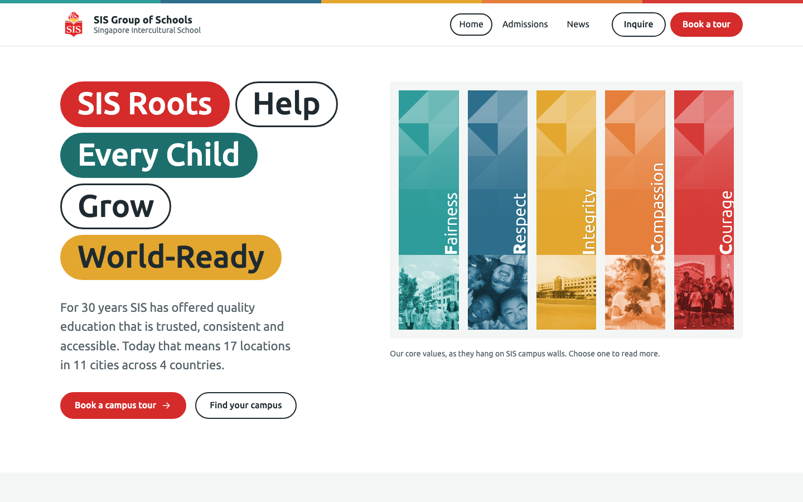

| Core values | PACE | University |
|---|---|---|
| 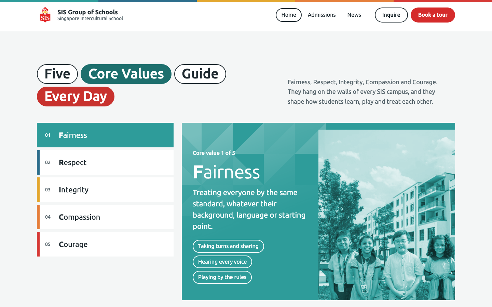 | 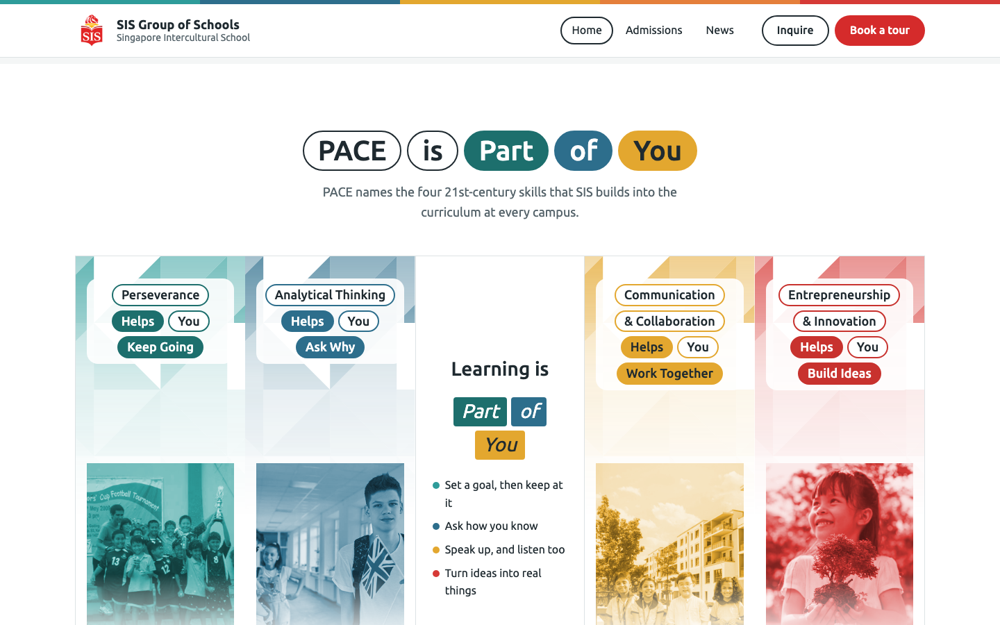 | 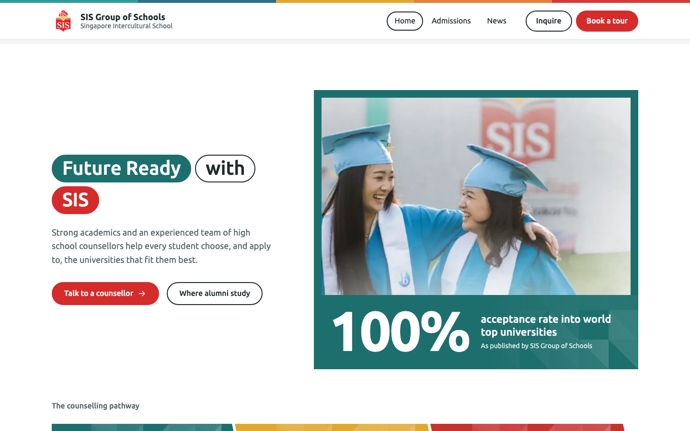 |

## Before / after

The current sisschools.org, the first pass (v1) and the final design (v2), captured at 1440px on 23 Sep 2026.

| SIS today | v1 | v2 |
|---|---|---|
| 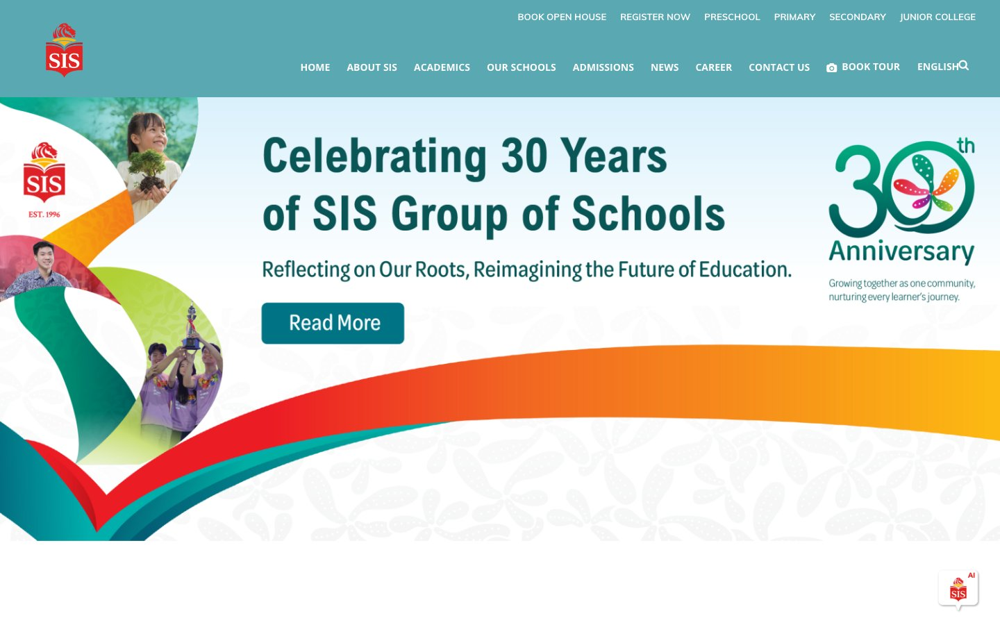 | 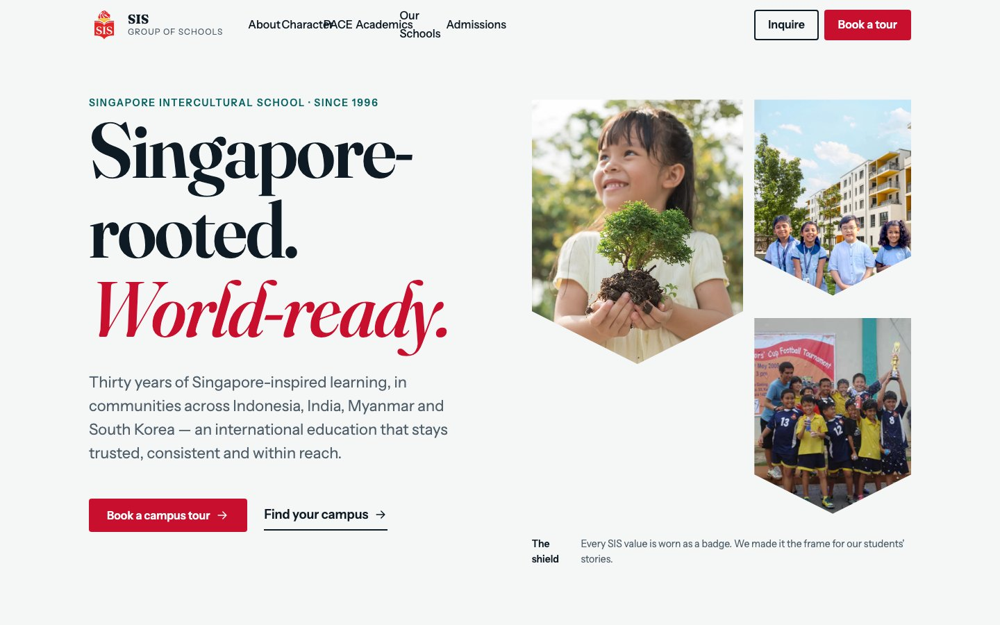 |  |

On a phone (390px):

| SIS today | v1 | v2 |
|---|---|---|
| 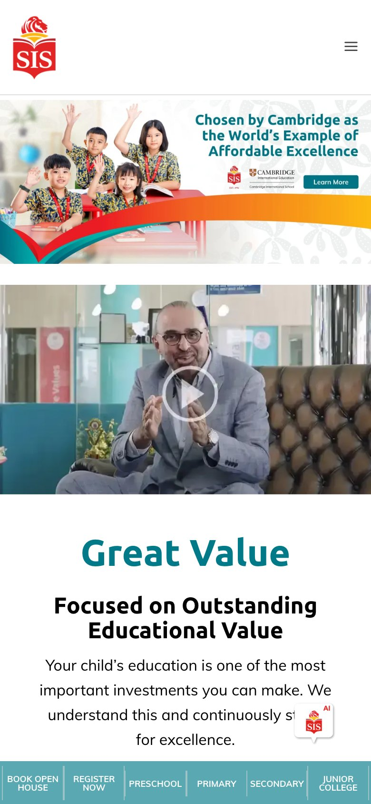 |  | 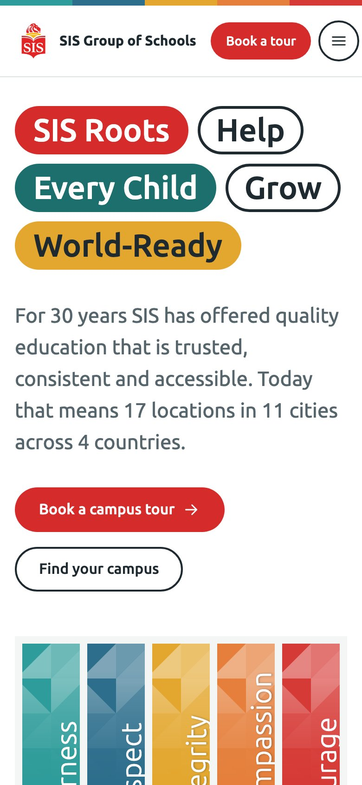 |

<details>
<summary>Whole homepage, side by side</summary>

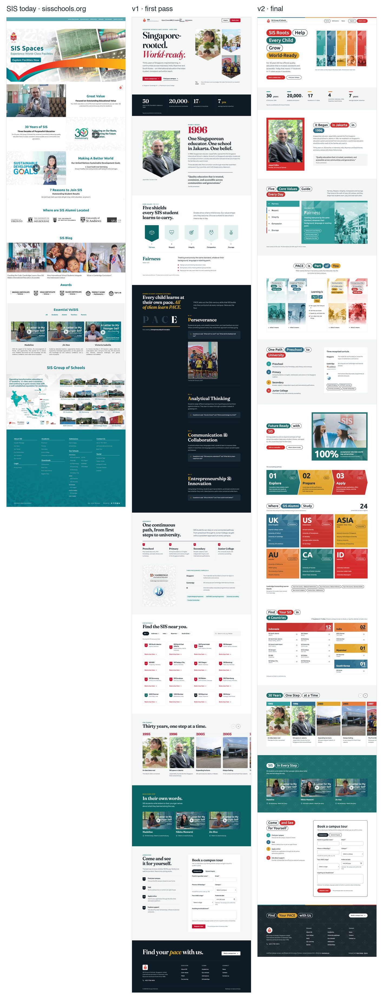

</details>

**SIS today**: a carousel of banners, centred teal headings, lots of small type and a template feel. The real brand assets — the values, PACE, the murals — are hidden on inner pages.

**v1**: AI slop.

**v2**: built from SIS's own campus walls. Value-colored banners, duotone photos, pill headlines, one rounded sans. It looks like SIS because the materials are SIS's.

## How it was built

The whole site came out of one Open Design session — a single conversation, about 90 minutes, around 15 rounds of feedback. Here are the key moments.

### v1: AI slop

The first prompt was roughly: "Redesign sisschools.org, the current one is dated. Study their core values and PACE, and borrow the narrative logic of jisedu.or.id (not its UI)."

The agent read both sites and picked up the real material: the five FRICC values, the four PACE outcomes, the logo, 30 years of history photos. It took JIS's storytelling order — vision → character → learning → proof → admissions — and that order survived all the way to the final version.

But the visuals weren't there. v1 (kept at [`archive/v1.html`](archive/v1.html)) used a Fraunces serif, shield-shaped photo crops and small uppercase labels everywhere. Polished, but it could have been any school. My feedback was one line: "It doesn't feel like SIS, and it feels AI-made."

### The fix: two phone photos of the actual building

What changed everything was two photos I took on my phone at the SIS campus (now in [`design-references/`](design-references/)): the "Feelings are Part of You" wall and the Core Values façade by the entrance.

| "Feelings are Part of You" wall | Core Values façade |
|---|---|
| 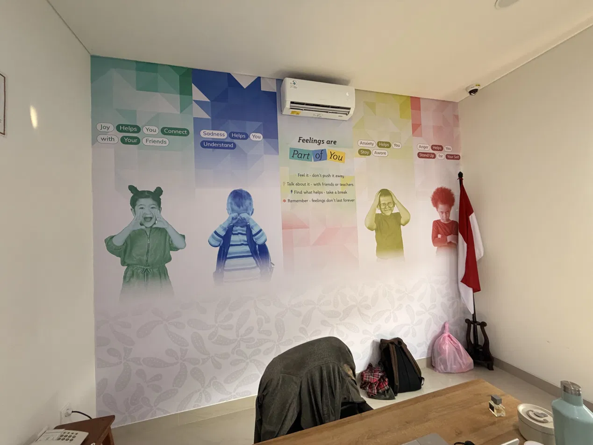 | 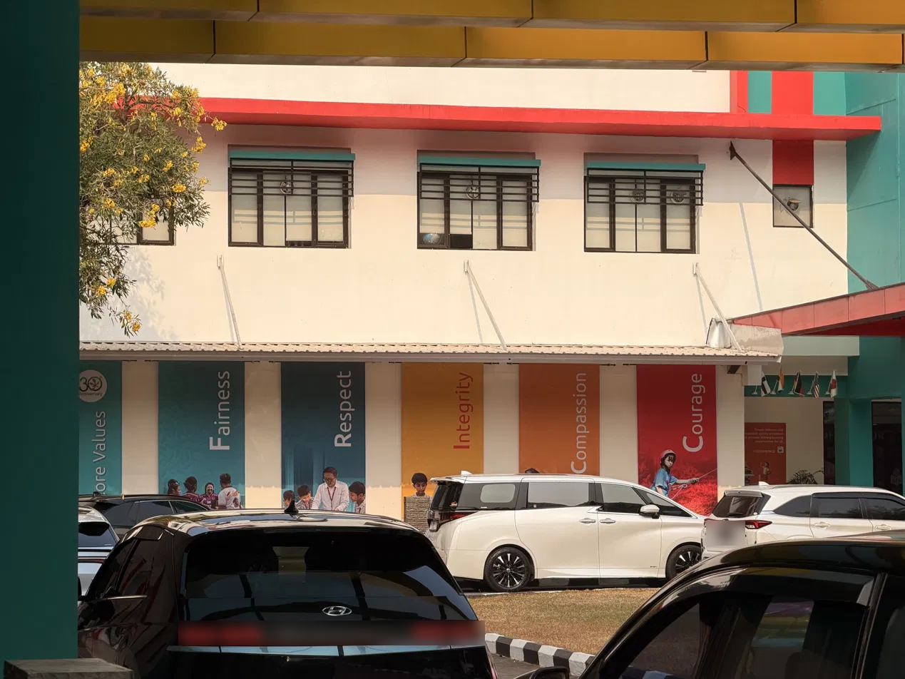 |

Once the agent saw those, it dropped its own aesthetic and started lifting the design language directly off the walls:

Tall vertical banners, one color per value (teal, blue, mustard, orange, red), rotated type with a bold initial — same as the façade. These became the hero. Photos tinted to their banner color using SVG `feColorMatrix` + `feComponentTransfer` filters (`#duo-fairness` and friends in `index.html`), so any real SIS photo slots right into the palette. The wall writes "Joy · Helps · You · Connect" as alternating filled and outlined capsules — that became the site's headline system: *SIS Roots · Help · Every Child · Grow · World-Ready*. One rounded humanist sans (Ubuntu) close to the lettering on the posters, pure white background, no beige, no gradients, no serif.

Looking back, feeding the AI real physical artifacts from the campus worked far better than feeding it adjectives.

### Then a bunch of small fixes

Each round was one or two sentences of concrete feedback:

"The 'Compassion' heading is clipped by the photo" → type sizes follow the container, not the viewport. "Right column doesn't line up with the pills" → top alignment, `white-space: nowrap` on nav items, hamburger below 1240px. "Add a little easter egg to the banners" → banners sway as your cursor passes, photos regain color on hover, and typing `fricc` sends a wave across all five. "The campus list is boring and bloated" → cut the map, filters and 16 cards down to a light directory grouped by country.

What worked: point at the exact element (Open Design lets you click-select), say what's wrong rather than how to fix it, keep taste decisions for yourself.

### Production cleanup (Claude Code)

The Open Design export was already plain static HTML/CSS/JS with a handoff doc (`DESIGN-HANDOFF.md`, `DESIGN-MANIFEST.json`). Before deploying, Claude Code ran every page in headless Chromium at 1440 / 390 / 360px and fixed what turned up: `stories.html` threw `moreLabel is not defined` so the story tiles never rendered; on phones the header was 60–73px wider than the screen, pushing the hamburger off-screen; added a footer disclaimer, the Open Design credit and `noindex`.

After those fixes, all 27 internal links load with no JS errors, the mobile drawer opens and form validation works.

## Structure

```
index.html            home (hero, values, PACE, academics, university, campuses, history, stories, tour form)
admissions.html       steps, tour/inquiry form, parent FAQ
news.html, article.html?a=…
stories.html          8 student stories, filterable, modal detail
campus.html?c=…       one template, 16 campuses
scholarships.html, careers.html, contact.html
assets/               sis.css / home.css / pages.css, sis.js / home.js, data.js, images
archive/              v1 and pages removed during iteration, kept for comparison
design-references/    the campus photos that defined v2
docs/                 screenshots and before/after comparisons
```

No build step. Open `index.html`, or serve the folder:

```bash
python3 -m http.server 8000
```

## Credits

Design: by [Sol](https://github.com/sol1560), made in [Open Design](https://github.com/nexu-io/open-design) by nexu-io. Content, logo and photography: [SIS Group of Schools](https://sisschools.org/). Values and PACE explanations are draft copy. Deployed on Vercel.
